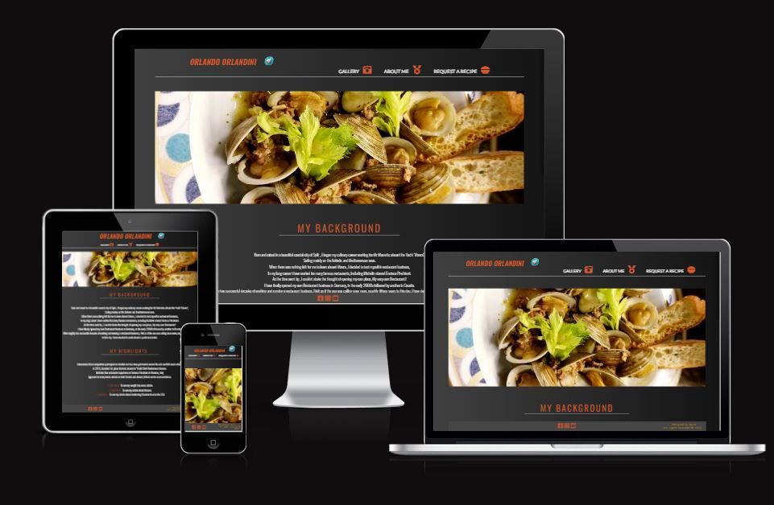

# Head Chef's website.

This website was created in an effort to gather all of the information about Orlando (A local celebrity master chef from Croatia.) , Under one umbrella.  
Thus greatly simplifying the users search for information about Orlando.

The entire project took roughly a week to complete.

 - To visit website [Click here...](https://karlox01.github.io/My-first-project-repo/)

***

## __Website Structure__ -

_This webpage consists of three main pages ;_
*  __Landing page__ - [To visit click here...](https://karlox01.github.io/My-first-project-repo/)

 Provides an index page, For the user this is the first page experienced when they open the website, It is complied with useful information about Orlando's previous work roles , background and highlights.
* __Gallery page__ - [To visit click here...](https://karlox01.github.io/My-first-project-repo/gallery.html)

 Just as the name implies this is the page where a user can find the latest photographs of Orlando's work.

* __Request a recipe page__ - [To visit click here...](https://karlox01.github.io/My-first-project-repo/form.html)

 This is the page where a user can personally request a recipe from Orlando, By completing a short form.

 *** 

 ## __Appearance__

 ## Colors

 I have decided to utilize 3 main colors on this website.

  * #DC582A Used mostly on headers it is meant to signify high importance.
  * #FFFFFF Used on most of the paragraph text.
  * #464646 Used as a background on the fixed footer 

  

 
## Fonts

__Three different fonts were used on this website , and they include.__  

__Lato__  
* Used primarily on the header navigation links and the form elements.

__Oswald__   
* Used extensively throught the page , most of the observed font is Oswald in the various font-weight options.

__San serif__
* Used as a backup font , Not a primary font on any of the page elements.
*** 

 ## __Features__

## Navigation/Header bar 

* The very first a user gets to see when they open the website is the 
The below navbar is displayed across all three pages , It is fully mobile/desktop responsive, And includes header/title , Short description, Further links to sections across the first page , as well as links to the other two pages, It also includes links to Orlando's social media sites.

 ## Landing photograph 

* And a second aspect but none the less important to the landing page is welcome photo,  
It stylishly incorporates various dishes prepared by Orlando.  
It is important to note it is fully responsive, and will shrink down to smaller sizes on mobile devices.

## Curriculum Vitae Section 

* Moving on towards the middle of the page we come across the recent Curriculum vitae section, Here a user can find all the recent positions held by Orlando, This is useful for both Orlando and end user , In a way that Orlando can use this website as a CV of a sort, To attract potential recruiters, While the user can find more information about his recent ventures , Or if potentially a recruiter is browsing the site , They can find all the relevant info right there.

## History and Background 

* On the bottom of the page user can find more information about Orlando's history and highlights of his career, Some of the highlights include links to third party websites that featured some of Orlando's work in the past.

 ## Footer 

* And the very last section of this page is the footer, Footer is fixed in place, So it always appears on the bottom of the website, It includes links to Orlando's social media sites , as well as copyright info. 
It is displayed the very same across all three pages.

## Gallery

* Gallery includes both the navigation/header bar , As well as the footer.
It consists of dozens of images , Displaying the most recent dishes prepared by Orlando.

## Request a recipe

* As the title suggests request a recipe is the final aspect to this webpage , It connects the user to Orlando , through a small form.
By completing this simple but stylish form, end user requests a recipe information from Orlando.

***

## __Testing__

Moving on to the testing aspect of this project , 

i can confirm the code used on this project has been tested with 

- https://validator.w3.org/ for HTML
- https://jigsaw.w3.org/css-validator/ for CSS

Both of which have come back with no errors.

It is also important to mention there are no known bugs on this webpage.

If you do however encounter an error or a bug while browsing the webpage , Please do contact me.

***

## __Deployment__

- The site was deployed to GitHub pages. The steps to deploy are as follows:
- In the GitHub repository, navigate to the Settings tab 
- From the source section drop-down menu, select the Master Branch
- Once the master branch has been selected, the page will be automatically refreshed with a detailed ribbon display to indicate the successful deployment. 

*** 

## __Credits__

### External Content

- The icons in the footer and nav bar, were taken from [Font Awesome](https://fontawesome.com/)
- News articles were sourced from , https://slobodnadalmacija.hr/ , And   
https://www.total-croatia-news.com/
- All of the other information , At my request , Was provided by Orlando.

### External Media

- Form page contains a beautiful third party image , It can be found in the link provided below.

https://wallpaperaccess.com/food-4k

- All of the images used in the gallery are the propery of Orlando , And can not be used without his explicit permission.

